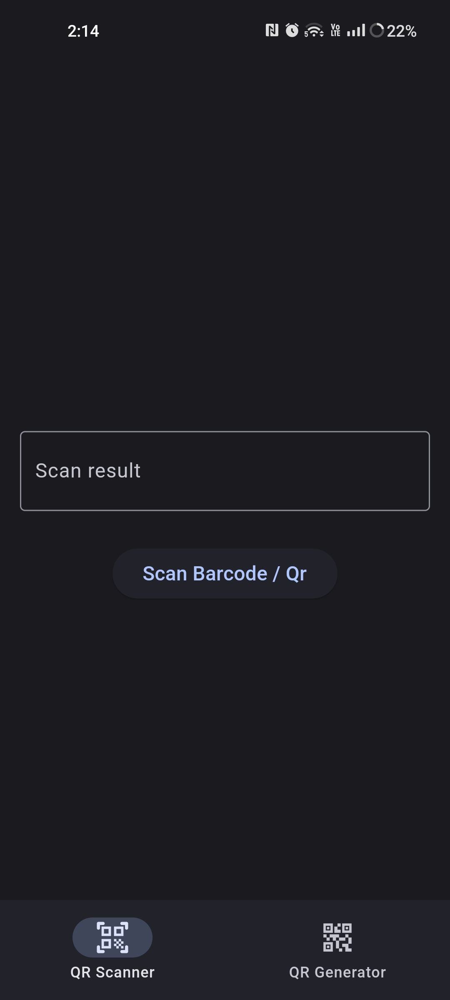
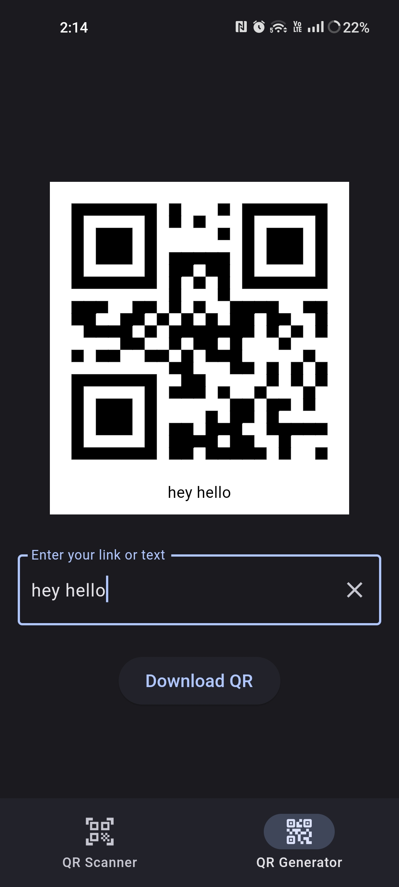

# QR Code App with QR Code Generation and Barcode/QR Scanning Functionality using Flutter


This Flutter application is designed to provide users with the ability to generate QR codes and scan barcodes/QR codes using their mobile devices. The app is developed using Flutter, a popular UI framework for building natively compiled applications for mobile, web, and desktop from a single codebase.

## Features

1. **QR Code Generation**: Users can easily generate QR codes containing various types of information such as URLs, text, contact information, and more.

2. **Barcode/QR Code Scanning**: The app offers barcode and QR code scanning functionality, allowing users to quickly extract information from these codes.

3. **User-Friendly Interface**: The user interface is designed with a focus on simplicity and usability, ensuring that users can navigate and utilize the app's features effortlessly.

## Screenshots

 

## Getting Started

To get started with the QR Code App, follow these steps:

1. **Clone the Repository**:
   ```
   git clone https://github.com/akodali9/qr_app.git
   cd qr_app_
   ```

2. **Install Dependencies**:
   ```
   flutter pub get
   ```

3. **Run the App**:
   ```
   flutter run
   ```

### Generating QR Codes

1. Launch the app on your device.
2. Choose the "Generate QR Code" option from the main menu.
3. Enter the desired information (URL, text, contact details, etc.) that you want to encode in the QR code.
4. The generated QR code will be displayed on the screen. You can save it to your device or share it with others.

### Scanning Barcodes/QR Codes

1. Launch the app on your device.
2. Choose the "Scan Code" option from the main menu.
3. Allow the app to access your device's camera.
4. Point the camera at the barcode or QR code you want to scan.
5. Once the code is recognized, the app will extract the information and display it on the screen and can be copied to the clipboard.

## Dependencies

This app utilizes the following dependencies to provide its functionality:

- [flutter_barcode_scanner](https://pub.dev/packages/flutter_barcode_scanner): A Flutter plugin for scanning both QR codes and barcodes.
- [qr_flutter](https://pub.dev/packages/qr_flutter): A package for generating QR codes in Flutter.
- Other Flutter dependencies as specified in the `pubspec.yaml` file.

## Contributing

Contributions to the QR Code App are welcome! If you find any bugs, have feature requests, or would like to contribute in any way, please feel free to open an issue or a pull request on the GitHub repository.

## License

This project is licensed under the [MIT License](LICENSE).

## Contact

For any inquiries or questions, please contact [akashkodali6@gmail.com](mailto:akashkodali6@gmail.com).

---

Thank you for using the QR Code App! We hope you find it useful and efficient for generating QR codes and scanning barcodes/QR codes. Your feedback is valuable to us, so don't hesitate to reach out if you have any suggestions or concerns.